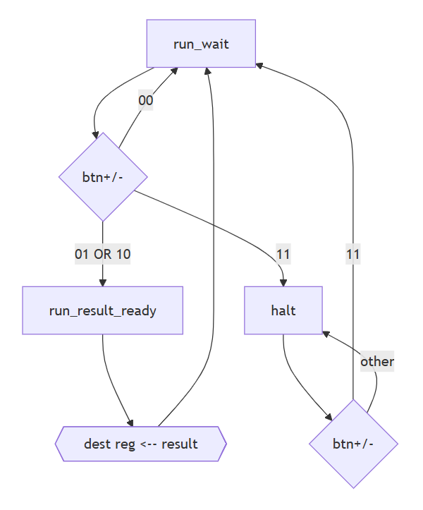

# CS F342 – Computer Architecture
## Lab 2: Sequential Verilog Foundations

---

## 1. Objective

The objective of **Lab 2** is to introduce **state, time, and control** in digital systems using Verilog.

In this lab, you will:

- Understand how **hardware stores state**
- Correctly write **clocked (sequential) Verilog**
- Distinguish clearly between:
  - combinational logic
  - sequential (state-holding) logic
- Learn the role of:
  - clocks
  - resets
  - registers
- Observe and reason about the difference between:
  - blocking assignments (`=`)
  - non-blocking assignments (`<=`)
- Design and reason about **finite state machines (FSMs)**

This lab marks a conceptual shift from:

> “logic that computes”  
to  
> “hardware that remembers and reacts over time”.

---

## 2. Background: Sequential Logic in Verilog

### 2.1 What makes logic sequential?

A circuit is **sequential** if:
- its outputs depend on **past inputs**
- it contains **storage elements** such as flip-flops or registers

In Verilog, state is modeled using:
- `reg` variables
- updated inside **clocked `always` blocks**

---

### 2.2 Clocked always blocks

A typical sequential block looks like:

```verilog
always @(posedge clk) begin
  q <= d;
end
```

Key points:
- The block executes **only on the rising edge of the clock**
- The value of `q` updates **only at the clock edge**
- `<=` (non-blocking assignment) is required for sequential logic

---

### 2.3 Reset behavior

A reset initializes hardware to a known state.

Two common styles:
- **Synchronous reset**: reset is checked inside the clocked block, and thus, reset occurs at the next rising edge
- **Asynchronous reset**: reset is included in the sensitivity list, and thus it occurs immediately when the reset signal itself switches

You will implement and compare both.

---

### 2.4 Blocking vs non-blocking assignments

- Blocking assignment (`=`):
  - Executes immediately
  - Suitable for combinational logic
- Non-blocking assignment (`<=`):
  - Updates occur together at the clock edge
  - Required for sequential logic

Using blocking assignments incorrectly in sequential logic leads to subtle bugs.
You will observe this directly in Task 3.

---

## 3. Lab Structure

```
labs/lab02/
├── manual.md
├── task1/
│   └── dut.v
├── task2/
│   └── dut.v
├── task3/
│   └── dut.v
├── task4/
│   └── dut.v
├── task5/
│   └── dut.v
├── tb/
│   ├── tb_dff.v
│   ├── tb_register.v
│   ├── tb_shiftreg.v
│   ├── tb_counter.v
│   └── tb_fsm.v
```

Rules:
- Each task has exactly **one top-level module named `dut`**
- Testbenches are provided and must **not** be modified
- Generated files go into `artefacts/lab02/`

---

## Task 1: D Flip-Flop with Active Low Reset (Starter)

### Objective
Implement a **positive-edge-triggered D flip-flop (DFF)**, and study reset behavior.

### What is provided
- Starter code for a D flip-flop **without reset**
- test bench for task 1 `tb_task1.v`

### What you must do
1. Add a **synchronous _active low_ reset in task1.1**
2. Add an **asynchronous _active low_ reset in task 1.2**
3. Simulate both versions using the same testbench
4. Compare waveforms  
   1. Open both VCD files simultaneously one above the other to compare.  
   2. You should be able to explain everything that you observe in both waveforms.  
   3. Take a screenshot and annotate the key difference, and save it at `artefacts/lab02/task1.png`

### Concepts reinforced
- Clock edges
- Reset semantics
- Timing of state updates

---

## Task 2: Register (Structural Design)

### Objective
Build an **8-register** by **structurally composing** the D flip-flops from Task 1.

### Requirements
- Repeat the following for sync and async reset (task2.1 and 2.2 respectively)
- Do not rewrite flip-flop logic
- Instantiate multiple DFF modules (copy the modules from task 1 into task 2 folder and name the modules _and_ files dff)
- Use vector signals at the top level (i.e. `input[7:0] d`, `output[7:0] q`) instead of defining individual bits.

---

## Task 3: Shift Register (Blocking vs Non-blocking)

### Objective
Implement a **shift register** from scratch using **behavioral modeling** and observe the effect of:
- blocking assignments (`=`)
- non-blocking assignments (`<=`)

### What is provided
- Starter code for shift register is provided in task3.1
- Test bench file `tb_task3.v`

### What you must do
1. Compile and run task3.1 with the appropriate test bench
2. Observe the waveforms and identify what is wrong in the functionality of the shift register
3. The same code is provided in task3.2. Modify this code to correct the error from 3.1 by using non-blocking assignments. **Do not modify task3.1 code**.
4. Compile and run 3.2.  
Open the waveforms of 3.1 and 3.2 one below another.  
Take a screenshot showing how the error is fixed and correct behavior is observed.  
Annotate the region and add at `artefacts/lab02/task3.png`
5. Optional: does changing the sequence of blocking statements (3.1) change the results? Find a sequence of blocking statements that will give correct behavior (although it is a WRONG implementation).

---

## Task 4: Counter 

### Objective
Design a **simple 8-bit up-counter**.

### Requirements
- Increment by 1 on every positive clock edge
- Include reset
- Purely sequential design
- task4.1: using the DFFs from task1.1 (sync reset)
- task4.2: using the DFFs from task1.2 (async reset)
- Compare the resulting waveforms and make sure you understand everything that you observe

---

## Task 5 (Homework, evaluative): FSM for a sequential adder / subtractor

### Objective
Design an FSM-controlled system integrating registers, arithmetic, and user-driven control.

### Datapath
- Two 8-bit registers: R0 and R1 (use one of the modules you wrote in task2)
- Arithmetic: add and subtract (use the adder-subtractor module from lab01/task5)
- Write-back to either register

### Control Inputs

Operation buttons `op[1:0]`:

| op | Meaning |
|----|--------|
| 00 | No-op |
| 01 | Add |
| 10 | Subtract |
| 11 | Toggle halt/run |

Destination select button `dest`:
- 0 → write to R0
- 1 → write to R1

Buttons are **level-sensitive** ie button levels are read during clock transition to decide actions; button level changes do not trigger anything.

---

### FSM States

1. RUN_WAIT  
2. RUN_RESULT_READY  
3. HALTED  


FSM must be implemented **behaviorally using `case(state)` only**.

---

### Reset Behavior
- Reset places FSM in RUN_WAIT
- Registers must be initialized to known values on reset

---

## Submission

**After every task**
- commit `dut.v` and `vcd` files with specific commit message, `lab02 taskx`

**Task 5**
- commit `dut.v` with the **exact commit message** `lab02-eval`
Any commit with this name will run through the autograder, so if there is a correction, you can make it and recommit with the same message.

---

## 11. Learning Outcomes

After Lab 2, you should be able to:
- Write correct sequential Verilog
- Reason about clocked behavior
- Debug timing-related bugs
- Design simple FSMs

---